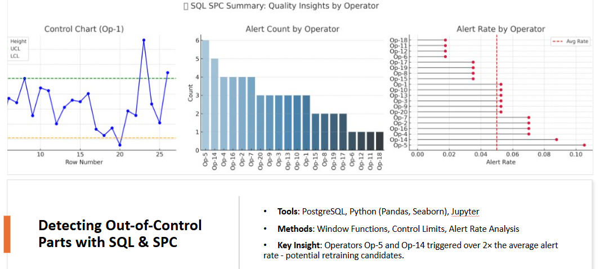

# Evaluating a Manufacturing Process using SQL & Python

---

## Project Overview

This project analyzes a historical dataset from a manufacturing process using SQL and Python to implement **Statistical Process Control (SPC)**. The goal is to monitor product quality and operator performance by identifying parts that fall outside acceptable height tolerances.

The project is based on the final assignment from the DataCamp *SQL for Business Analysts* skill track and has been extended with deeper analysis and visualizations for portfolio demonstration.

---

## Objectives

- **Detect anomalies** in product height measurements using dynamic control limits.
- **Identify operators** who produce a higher-than-average number of out-of-control parts.
- **Visualize** the control process and operator performance through meaningful charts.

---

## Key Concepts & Techniques

- **Window functions in SQL** to calculate rolling averages and standard deviations.
- **SPC limits** using control limit formulas:  
  - `UCL = avg + 3 * stddev / sqrt(n)`  
  - `LCL = avg - 3 * stddev / sqrt(n)`
- **Nested queries & CTEs** to structure multi-step logic.
- **Boolean alert flags** to detect quality issues.
- **Alert rate analysis** to compare operator performance.
- **Data visualization** with Seaborn and Matplotlib.

---

## Dataset Overview

The data is available in the  table which has the following fields and data types: 

    - `item_no`: the item number, BIGINT
    - `length`: the length of the item made, DOUBLE PRECISION 
    - `width`: the width of the item made, DOUBLE PRECISION
    - `height`: the height of the item made, DOUBLE PRECISION 
    - `operator`: the operating machine, TEXT

---

## SQL Analysis

### Step 1: Flagging Out-of-Control Products  
Using SQL, each product's `height` was compared against its rolling control limits calculated over a window of 5 rows (partitioned by operator). Alerts were flagged when heights fell outside the calculated limits.

### Step 2: Aggregating Alerts per Operator  
A summary table was created to count how many alerts each operator triggered. This was used to evaluate which machines consistently failed to produce within the control range.

### Step 3: Alert Rate Analysis  
To normalize for different operator workloads, alert rates (`alerts_count / total_alerts`) were calculated and compared to the average. Operators above this average were flagged as potential concerns.

---

## Visualizations

### Control Chart (Dynamic)
A moving control chart was plotted for each operator, showing height values over time with rolling UCL/LCL/mean bands and color-coded alerts.

### Control Chart (Fixed)
To complement the dynamic version, a traditional SPC chart was added using fixed global limits for one operator to contrast methods and assumptions.

### Alerts by Operator
A bar chart displayed the number of alerts per operator, highlighting those above the average in a distinct color.

### Alert Rate Lollipop Chart
This visual shows normalized alert rates per operator with a reference line for the average rate — making outliers easy to spot.

---

## Key Findings

- A few operators consistently exceeded control limits at significantly higher rates than average.
- Dynamic control limits revealed subtle shifts in process quality that fixed limits might miss.
- Visualizing both control methods helped contextualize outlier behavior and select appropriate monitoring strategies.

---

## Next Steps (Optional Extensions)

- Automate alert monitoring via SQL dashboard or BI tool
- Analyze operator performance trends over time
- Combine with maintenance logs for root cause analysis

---

## Tools & Technologies

- PostgreSQL / SQL (window functions, CTEs)
- Python (Pandas, Seaborn, Matplotlib)
- Jupyter Notebook
- GitHub

---

## 📬 Contact

Feel free to reach out if you’d like to discuss the project or see more examples of SQL analysis.
